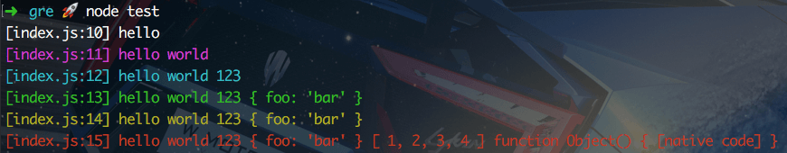
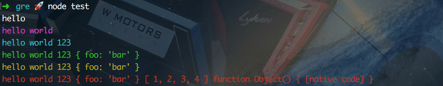
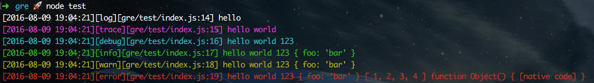
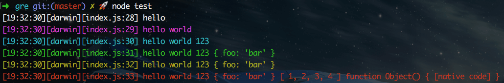

gre
---
日志输出


### Install
```sh
npm i gre --save
```

### Example 1
```js
var gre = require('gre');
// dev模式
var g = gre.create();

g.log('hello');
g.trace('hello', 'world');
g.debug('hello',  'world', 123);
g.info('hello',  'world', 123, {foo:'bar'});
g.warn('hello', 'world', 123, {foo:'bar'});
g.error('hello', 'world', 123, {foo:'bar'}, [1, 2, 3, 4], Object);
```
==> Result :  


### Example 2
```js
var gre = require('gre');
// tiny模式 最小化输出
var g = gre.create('tiny');

g.log('hello');
g.trace('hello', 'world');
g.debug('hello',  'world', 123);
g.info('hello',  'world', 123, {foo:'bar'});
g.warn('hello', 'world', 123, {foo:'bar'});
g.error('hello', 'world', 123, {foo:'bar'}, [1, 2, 3, 4], Object);
```
==> Result :  


### Example 3
```js
var gre = require('gre');
// prod模式
g = gre.create({
    format: 'prod',
    project: path.dirname(__dirname)
})

g.log('hello');
g.trace('hello', 'world');
g.debug('hello',  'world', 123);
g.info('hello',  'world', 123, {foo:'bar'});
g.warn('hello', 'world', 123, {foo:'bar'});
g.error('hello', 'world', 123, {foo:'bar'}, [1, 2, 3, 4], Object);
```
==> Result :  


### Options
```js
{
    // 格式化字符串
    format: 'dev',
    // 是否彩色输出
    color: true,
    // 项目路径，配置次参数:path输出相对路径，不配置:path输出绝对路径
    project: '',
    // 默认时间格式化字符串
    dateformat: 'yyyy-MM-dd hh:mm:ss'
}
```

### Format String
内置配置
```js
dev: '[:file::line] :message',
tiny: ':message',
prod: '[:time[yyyy-MM-dd hh:mm:ss]][:title][:path::line] :message',
full: '[:time[yyyy-MM-dd hh:mm:ss.SSS]][:title][:path::line] :message',
time: '[:time[hh:mm:ss]][:file::line] :message',
fulltime: '[:time][:file::line] :message'
```
所有关键字
```none
:time[yyyy-MM-dd hh:mm:ss.SSS] :title :file :path :line :message
```
自定义关键字 & 自定义日志输出格式
```js
var os = require('os');
var gre = require('gre');

// 自定义关键字
gre.token('platform', () => os.platform())

// 自定义日志输出格式
var g = gre.create('[:time[hh:mm:ss]][:platform][:file::line] :message');

g.log('hello');
g.trace('hello', 'world');
g.debug('hello',  'world', 123);
g.info('hello',  'world', 123, {foo:'bar'});
g.warn('hello', 'world', 123, {foo:'bar'});
g.error('hello', 'world', 123, {foo:'bar'}, [1, 2, 3, 4], Object);
```
==> Result :  

